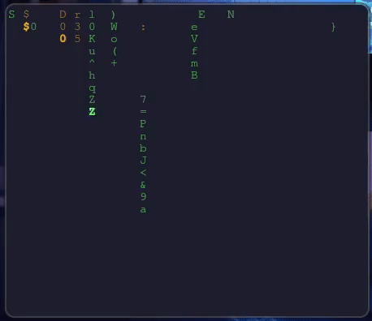

Writing a terminal based matrix digital rain is fairly simple; Even utilizing raw ANSI escape sequences, we can make one in under 20 lines of code with a shell scripting language like Bash. Similarly in most programming languages

For simplicity of the article, we won't implement starting position, random initial character highlighting or anything too fancy. This implementation utilizes the [Select Graphic Rendition](https://vt100.net/docs/vt510-rm/SGR.html), specifically the 4-bit green color sequence for portability as well

For a full-featured implementation, check out the [matrix digital rain I wrote in Bash](https://github.com/wick3dr0se/matrix) (the inspiration for this post!)

## Why Bash?
Bash is an excellent choice for this, because Bash comes pre-installed nearly everywhere. Most of the time it's the default shell interpreter. When writing pure Bash, it's super portable and easy to write. Generally Bash performs pretty well if usage of shell invoking procedures (such as command substituion) and external calls are limited

## Concept
This is just a general, base concept for a minimal matrix digital rain

My mind works well off concepts - In hopes it could help you, I'll leave this here to give some context on the implementation

```
Trap exit - cleanup
Initialize terminal
Loop forever
    {
        Calculate random column
        Calculate random speed
        Calculate random symbol length
        Loop - over terminal lines
            Calculate random symbol
            Print down calculated column
            If iteration > symbol length, erase
            Sleep (print speed)
    } Send to background
    Sleep (print frequency)
```

## Implementation
You don't have to use raw ANSI escape sequences, you can use an abstraction like `tput` or a [TUI library I wrote](https://github.com/wick3dr0se/bashin) for writing scripts exactly like this one, among others of course. But for performance and portability's sake, it benefits to utilize ANSI escapes

Let's start by initializing the terminal. How this works is up to you but I would utilize the terminal's alternative buffer and disable the cursor. Using the alternative buffer has the advantage of disabling scrolling and allowing us to reset the terminal to its initial state

These sequences are [VT100 ANSI escape sequences](https://vt100.net/docs/vt100-ug/), which are the standard, that terminal manipulation libraries abstract away

```bash
init_term() {
    # \e is an escape sequence
    # the following sequences switch to the alternative buffer and hide the cursor
    printf '\e[?1049h\e[?25l'

    # sets terminal x and y to COLUMNS/LINES respectively
    shopt -s checkwinsize; (:;:)
}
```

This is where it gets a little interesting! We have to do some basic equations. Here we utilize Bash's builtin `$RANDOM` variable to give us a random integer in the specified range. First we should calculate our symbols starting column, then our symbols printing delay and finally the amount of symbols to print down a column. We should loop over the terminal lines plus symbol length and calculate a random symbol

Now it's time to put all our random calculations to work! Simply print the random symbol to the calculated column down the iterated row (line) and follow up behind the symbol length with an erase sequence. Wrapping up our rain function, sleep with the calculated delay to give the rain varying speed. Almost there! This is the bulk of it, and the entire complexity of the implementation

```bash
rain() {
    # random column between 1-terminal columns
    ((symbolCol=RANDOM%COLUMNS+1))
    
    # random sleep delay between 1-9
    ((symbolSpeed=RANDOM%9+1))
    
    # random length between 2-10
    ((symbolLen=RANDOM%9+2))

    # walk the terminal lines + symbol length
    for (( i = 0; i <= LINES+symbolLen; i++ )); do
        # random symbol
        symbol="${SYMBOLS:RANDOM%${#SYMBOLS}:1}"

        # print green symbol down calculated column
        printf '\e[%d;%dH\e[32m%s\e[m' "$i" "$symbolCol" "$symbol"
        
        # erase after symbol length 
        (( i > symbolLen )) && printf '\e[%d;%dH\e[m ' "$((i-symbolLen))" "$symbolCol"
        
        # rain (printing) speed
        sleep "0.$symbolSpeed"
    done
}
```

After defining our functions, the script is super simple, only requiring a run forever loop and call to our rain function, sent to the background, with a short sleep delay to prevent our rain from absolute downpour and potential CPU havoc. Modifying the terminal state is completely optional but worth it

Defining some symbols as a string

```bash
SYMBOLS='0123456789!@#$%^&*()-_=+[]{}|;:,.<>?'
```

Then we should probably trap some terminal cleanup so that we can reset our terminal state. Although one could just opt to close the terminal, skipping deinitializing and trapping interrupts entirely. Arguably the next step should be done first but in TUI scripts, it's common to define signal handlers before calling functions

```bash
trap 'printf "\e[?1049l\e[?25h"' SIGEXIT
```

Next, we initialize the terminal by calling our init_term function

```bash
init_term
```

To finish it off, we execute the run forever loop, call our rain function in the background and sleep between calls for density

```bash
# loop forever
for((;;)) {
    # call it and send it to the background
    rain &

    # rain density
    sleep 0.1
}
```

That's all!! Here is the entire implementation of our matrix digital rain in pure Bash using raw ANSI escape sequences, in under 20 lines of code!

```bash
init_term() {
    printf '\e[?1049h\e[?25l'
    shopt -s checkwinsize; (:;:)
}

rain() {
    ((symbolCol=RANDOM%COLUMNS+1))
    ((symbolSpeed=RANDOM%9+1))
    ((symbolLen=RANDOM%9+2))

    for (( i = 0; i <= LINES+symbolLen; i++ )); do
        symbol="${SYMBOLS:RANDOM%${#SYMBOLS}:1}"

        printf '\e[%d;%dH\e[32m%s\e[m' "$i" "$symbolCol" "$symbol" 
        (( i > symbolLen )) && printf '\e[%d;%dH\e[m ' "$((i-symbolLen))" "$symbolCol"
        sleep "0.$symbolSpeed"
    done
}

trap 'printf "\e[?1049l\e[?25h"' exit

SYMBOLS='0123456789!@#$%^&*()-_=+[]{}|;:,.<>?'

init_term

for((;;)) { rain & sleep 0.1; }
```

I hope the post was thorough and able to teach you something! If not, well sorry, I tried! Anyway, you're more than welcome to [support the project](https://github.com/wick3dr0se/matrix) by dropping a star on GitHub!